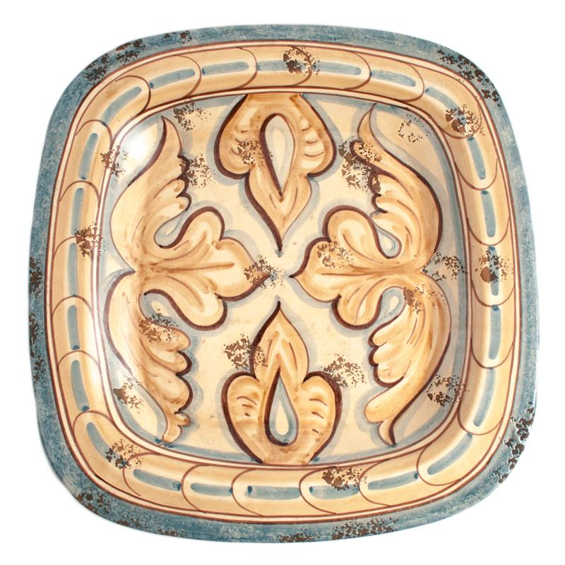

<html lang="en">

<!--  task 1  -->

<head>
    <meta charset="UTF-8">
    <meta name="description" CONTENT="Formula h2o">
    <title>ControlWork</title>

    <link rel="stylesheet" type="text/css" href="styleC.css" />
</head>

<body>
    <!--   task 2   -->
    

        <h1> Книжная лавка </h1>
        <h2> Здесь вы сможете найти журналы, книги, статьи</h2>
        <h3> а возможно и новых друзей :) </h3>
    

    <!--  task 3  -->
    

        <h3>Наши главные особенности:</h3>
        
 Хорошая поддержка 

        
 Быстрая доставка 

        
 Чат, в котором вы сможете найти друзей 

    

    <!--  task 4  -->
    

        
        
        
    

    <!--  task 5  -->
    

        <h3> Самые активные пользователи </h3>

        <!--  Нумерованный список  -->
        

            <ol>
                <li> Danya3311</li>
                <li> WhatIsLove</li>
                <li> Ragnarek</li>
            </ol>
        

        <h3> Наши партнеры</h3>

        <!--  не нумерованный список  -->
        

            <ul>
                <li> Google </li>
                <li> facebook</li>
                <li> youtube</li>
            </ul>
        

    

    <!--  task 6  -->
    

        <h3> Регистры</h3>
        <!-- Нижний регистр H2O -->
        

             H2O 
        

        <!--  Верхний регистр x2-->
        

             x2 
        

    

    <!--  task 7  -->
    

        <h3> Форма </h3>
        <form method="post">

            <!-- Инпуты -->
            

                <label for="username">Имя пользователя</label> 
                <input name="username" type="text"> 

                <label for="numb">Ваш номер в списке</label> 
                <input type="number" name="numb"> 

            

            <!--   Чекбокс   -->
            

                

                    <label for="rulesAgreement">Вы согласны с правилами использования?</label>
                    <input type="checkbox" name="rulesAgreement" id="rulesAgreement"> 

                    <label for="rulesAgreement">Вы согласны на нашу расслыку?</label>
                    <input type="checkbox" name="Newsletter" id="Newsletter"> 
                

            

            <!-- Радиобаттон -->
            

                 Ваш пол:
                

                    <input type="radio" name="gender" id="male" value="Male">
                    <label for="male">Мужчина</label> 

                    <input type="radio" name="gender" id="female" value="Female">
                    <label for="female">Женщина</label> 
                

            

            <!-- Мультиселект -->
            

                Ваша любимая стихия
                

                    <select multiple>
                        <option>Огонь</option>
                        <option>Вода</option>
                        <option>Земля</option>
                        <option>Воздух</option>
                    </select>

            

            <!--  text area  -->
            

                <label for="description">Расскажите, чего вы ждёте от нашего знакомства</label> 
                <textarea name="description" id="description"></textarea> 
            

            <!-- Отправка формы -->
            

                <button type="submit">Отправить</button>
            

        </form>
    

</body>

</html>
